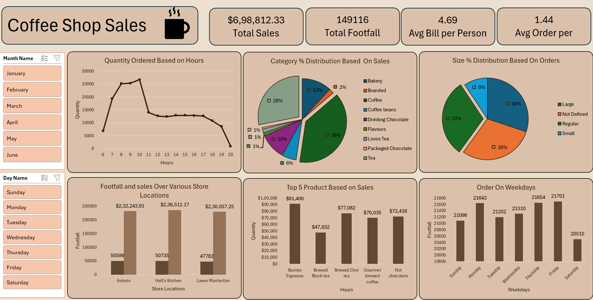

# ☕ Coffee Shop Sales Dashboard (Microsoft Excel)

A professional **Coffee Shop Sales Dashboard** built entirely in **Microsoft Excel** to analyze sales performance, customer behavior, product demand, and store performance.

This project demonstrates how Excel can be used as a powerful Business Intelligence (BI) tool by transforming raw sales data into an interactive dashboard using Pivot Tables, Pivot Charts, Slicers, KPI Cards, and Excel formulas.

---

## 📑 Table of Contents

- [Project Overview](#-project-overview)
- [Objectives](#-project-objectives)
- [Dashboard Preview](#-dashboard-preview)
- [Key Performance Indicators](#-key-performance-indicators)
- [Dashboard Features](#-dashboard-features)
- [Business Insights](#-business-insights)
- [Tools & Skills Used](#-tools--skills-used)
- [Repository Structure](#-repository-structure)
- [How to Use](#-how-to-use)
- [Learning Outcomes](#-learning-outcomes)
- [Author](#-author)

---

# 📌 Project Overview

This dashboard provides an interactive analysis of coffee shop sales using Microsoft Excel.

Users can filter data by **Month** and **Day** to explore sales trends, customer footfall, product performance, and store performance.

The dashboard is designed to help business owners make informed decisions using easy-to-understand visualizations.

---

# 🎯 Project Objectives

- Analyze overall sales performance.
- Compare store performance.
- Monitor customer footfall.
- Identify top-selling products.
- Analyze product category contribution.
- Understand customer purchasing behavior.
- Identify peak business hours.
- Create an interactive business dashboard using Microsoft Excel.

---

# 📷 Dashboard Preview




---

# 📊 Key Performance Indicators

| KPI | Value |
|------|-------|
| 💰 Total Sales | **$698,812.33** |
| 👥 Total Footfall | **149,116** |
| 🧾 Average Bill per Person | **4.69** |
| 🛒 Average Orders per Customer | **1.44** |

---

# 📈 Dashboard Features

## 📅 Interactive Filters

- Month
- Day of Week

---

## 📉 Quantity Ordered by Hour

Shows customer demand throughout the day, helping identify peak operating hours.

---

## 🥧 Category-wise Sales Distribution

Displays percentage contribution of each product category.

Categories include:

- Coffee
- Tea
- Bakery
- Drinking Chocolate
- Coffee Beans
- Loose Tea
- Packaged Chocolate
- Flavours
- Branded Products

---

## 🥤 Size-wise Order Distribution

Analyzes customer preference by beverage size.

- Large
- Regular
- Small
- Not Defined

---

## 🏪 Store Performance Analysis

Compares:

- Total Sales
- Customer Footfall

Across stores:

- Astoria
- Hell's Kitchen
- Lower Manhattan

---

## ⭐ Top 5 Products by Sales

Highlights the highest revenue-generating products.

- Barista Espresso
- Brewed Chai Tea
- Gourmet Brewed Coffee
- Hot Chocolate
- Brewed Black Tea

---

## 📅 Weekday Order Analysis

Compares customer footfall across all seven days of the week to identify the busiest days.

---

# 💡 Business Insights

Based on dashboard analysis:

- ☕ Coffee contributes the largest share of overall sales.
- ⏰ Customer demand peaks during the morning hours (approximately **8 AM–10 AM**).
- 🏪 Hell's Kitchen generates the highest sales among the three store locations.
- 🥤 Regular-sized beverages are the most frequently ordered.
- ⭐ Barista Espresso is the highest-selling product.
- 📈 Customer traffic remains consistent throughout the week, with Friday being one of the busiest days.
- 📍 Sales are evenly distributed across store locations, indicating balanced business performance.

---

# 🛠 Tools & Skills Used

### Tools

- Microsoft Excel
- Pivot Tables
- Pivot Charts
- Slicers
- Excel Formulas


### Skills Demonstrated

- Data Cleaning
- Data Preparation
- Data Analysis
- Dashboard Design
- Business Intelligence
- KPI Reporting
- Data Visualization
- Interactive Reporting

---

# 📁 Repository Structure

```text
Coffee-Shop-Sales-Excel-Dashboard/
│
├── Coffee_Shop_Sales_Dashboard.xlsx
├── Coffee_Shop_Sales.csv
├── README.md
├── Dashboard.png
└── Business_Insights.pdf
```

---

# 🚀 How to Use

1. Download or clone this repository.
2. Open **Coffee_Shop_Sales_Dashboard.xlsx** in Microsoft Excel.
3. Use the Month and Day slicers to interact with the dashboard.
4. Explore the charts and KPIs to gain business insights.

---

# 📚 Learning Outcomes

Through this project I improved my skills in:

- Building professional Excel dashboards
- Creating Pivot Tables and Pivot Charts
- Interactive dashboard design
- KPI reporting
- Business analytics
- Data visualization
- Business Intelligence using Excel


---

# 👨‍💻 Author

## Adarsh VS

**Aspiring Data Analyst**

### Skills

- Microsoft Excel
- SQL
- Power BI
- Python
- Data Analysis
- Data Visualization

---

## ⭐ Support

If you found this project useful, consider giving this repository a **Star ⭐**.

Thank you for visiting my project!
